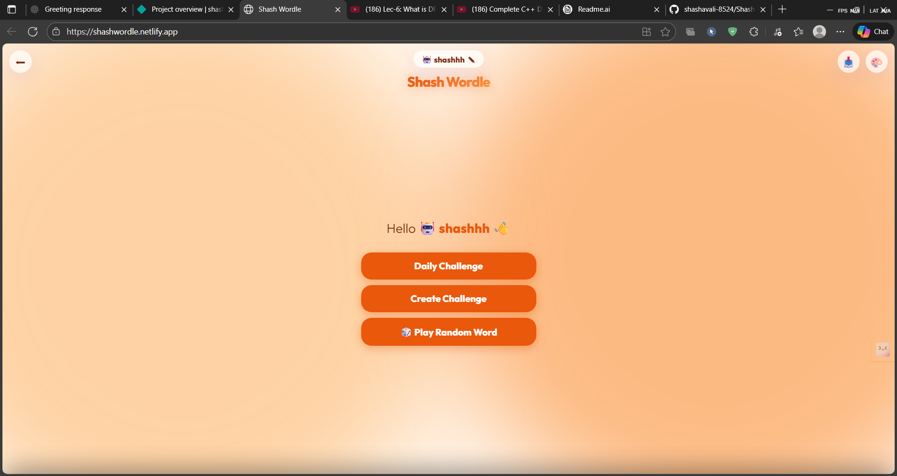
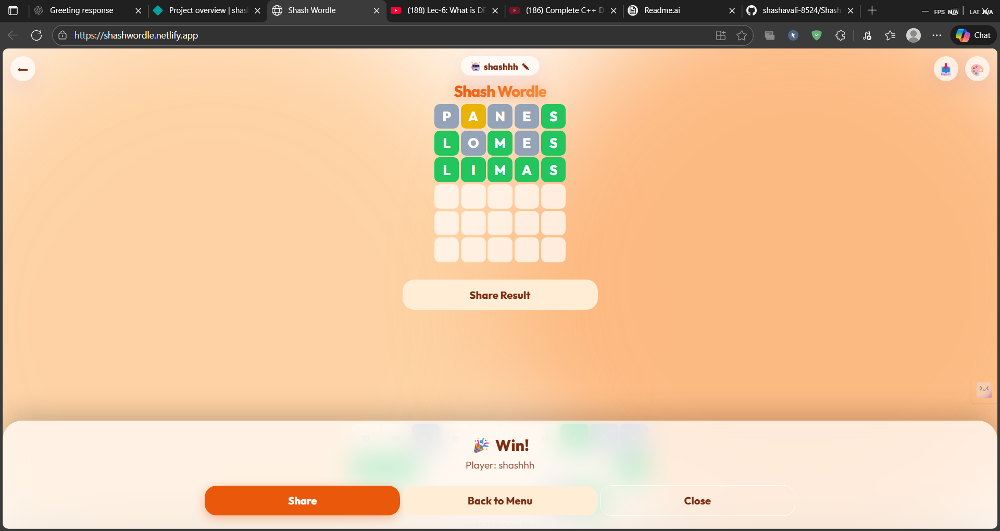
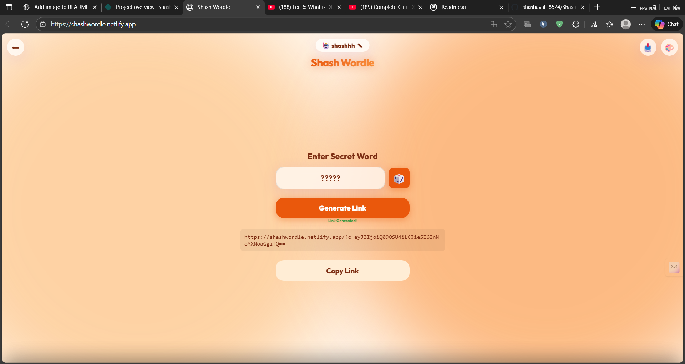

# Shash Wordle 🧠

A fun and engaging Wordle game with daily challenges and custom word options. This project provides a web-based implementation of the popular Wordle game, allowing users to play daily challenges or create their own custom word puzzles. It's designed as a Progressive Web App (PWA) for installable, app-like experience.

🚀 **Key Features**

*   **Daily Challenges:** Play a new Wordle puzzle every day.
*   **Custom Word Challenges:** Create your own challenges by selecting a secret word.
*   **Shareable Results:** Easily share your game results with friends.
*   **Theme Switching:** Toggle between light and dark themes for comfortable play.
*   **Avatar Selection:** Choose a personalized avatar.
*   **Progressive Web App (PWA):** Installable as a native app for offline play.
*   **Word Validation:** Guesses are validated against a dictionary of allowed words.
*   **Responsive Design:** Playable on various devices.

🛠️ **Tech Stack**

*   **Frontend:** HTML, CSS, JavaScript
*   **Fonts:** Google Fonts (Outfit)
*   **PWA:** Manifest.json
*   **Build Tools:** N/A (Vanilla JS)
*   **Other:** Local Storage (for user preferences), Web Share API

📦 **Getting Started**

### Prerequisites

*   A modern web browser (Chrome, Firefox, Safari, Edge, etc.)

### Installation

1.  Clone the repository:

    ```bash
    git clone <repository_url>
    cd <repository_directory>
    ```

2.  No installation steps are required as it is a client-side application.

### Running Locally

1.  Open `index.html` in your web browser.

    ```bash
    open index.html
    ```

    Or, serve the files using a local web server (e.g., using Python):

    ```bash
    python -m http.server
    ```

    Then, navigate to `http://localhost:8000` in your browser.

📂 **Project Structure**

```
shash-wordle/
├── index.html       # Main HTML file
├── script.js        # JavaScript logic
├── style.css        # CSS styling
├── manifest.json    # PWA manifest
├── words.txt        # Word list
└── README.md        # Project documentation
```

📸 **Screenshots**







🤝 **Contributing**

Contributions are welcome! Please follow these steps:

1.  Fork the repository.
2.  Create a new branch for your feature or bug fix.
3.  Make your changes and commit them with descriptive messages.
4.  Submit a pull request.

📝 **License**

This project is open-source and available under the [MIT License](LICENSE).

📬 **Contact**

If you have any questions or suggestions, feel free to contact me at [shashavali8524@gmail.com](mailto:your-email@example.com).

💖 **Thanks**

Thank you for checking out Shash Wordle! I hope you enjoy playing it.
